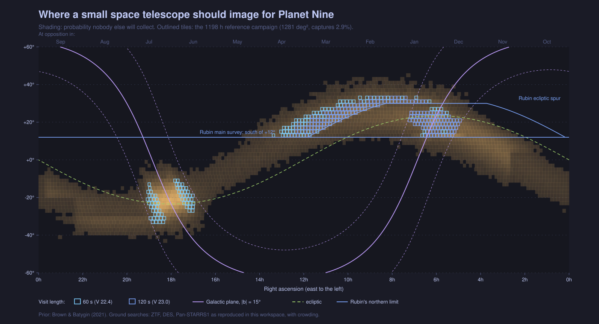
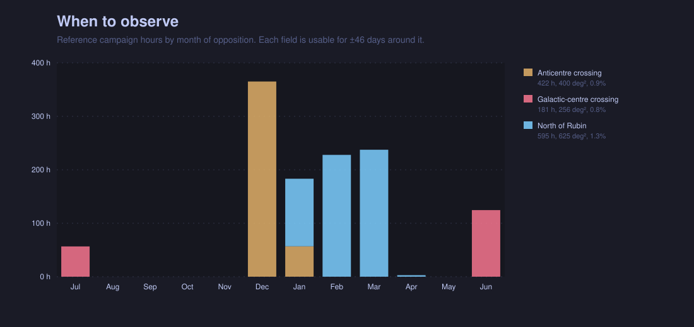
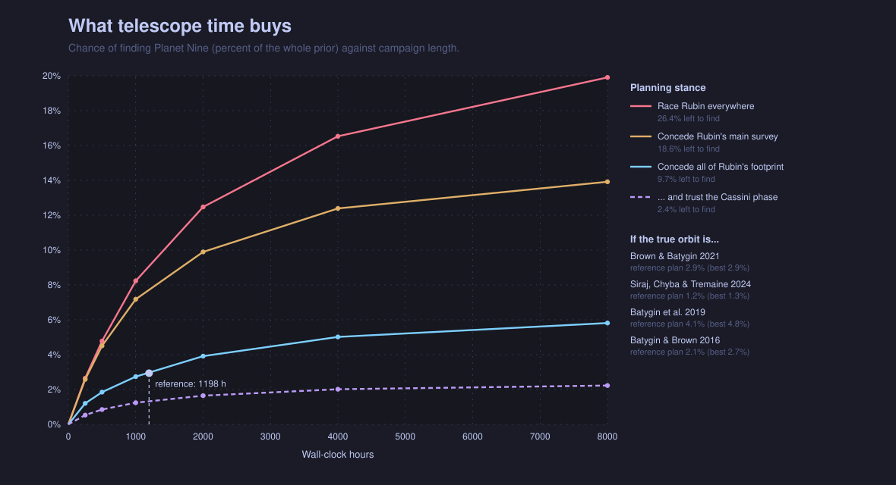

# Where a small space telescope should image

A strategy for the JBT 0.5 m + SPENCER concept (0.485 m, 0.32 deg² field,
0.13″ pixels, V ≈ 23.8 in 300 s) to find Planet Nine, and what it yields in
distant trans-Neptunian objects along the way.

Numbers in this document come from `cargo run --release -p p9-space-strategy`
and are reproduced in full in [TABLES.md](TABLES.md). The model is in
`crates/p9-space-strategy`.

## The strategy

Image three regions, wide and shallow, each near its opposition. Leave the rest
of the predicted band to Rubin.

| Priority | Region | RA | Dec | Area | Visit | Hours | When |
|---|---|---|---|---|---|---|---|
| 1 | Anticentre crossing (Taurus, Gemini, Auriga) | 4.8h–7.3h | +12° to +32° | 400 deg² | 120 s | 420 | Dec–Jan |
| 2 | North of Rubin (Gemini, Cancer, Leo) | 6.8h–13.5h | +12° to +34° | 625 deg² | 120 s | 595 | Jan–Mar |
| 3 | Galactic-centre crossing (Ophiuchus, Sagittarius) | 16.9h–19.2h | −34° to −10° | 256 deg² | 60 s | 180 | Jun–Jul |

Each field is visited four times and an object must be found in three of them.
The whole campaign is about 1,200 wall-clock hours over 1,280 deg² and 4,450
fields. The tile list is the `tiles` array of `figures/space_strategy.json`.



## Why these regions

Three facts decide the answer.

**The ground surveys have done most of the work, except in the Milky Way.**
ZTF, DES and Pan-STARRS1 together would already have found 74% of the predicted
orbits (the published figure is 78%). What they missed is faint, far south, or
in crowded sky. A ground survey loses the area within a seeing disc of every
star, so its completeness collapses toward the Galactic plane. A telescope
with 0.13″ pixels above the atmosphere loses six to twenty-five times less area per
star and keeps most of the plane. The predicted orbit crosses the plane twice,
and those two crossings hold the densest probability nobody has searched.

**Rubin will take the south.** Rubin reaches V ≈ 25 per visit over everything
south of +12°, and along the ecliptic up to +30°. Planet Nine is V ≈ 19–23, so
wherever Rubin looks it will find it. Duplicating that sky adds little. North
of Rubin's limit and away from its ecliptic spur, only this telescope is
looking.

**Area is dear and depth is cheap.** This telescope reaches V ≈ 23 in a
two-minute visit, which is already fainter than most of the predicted planet.
Its field is a third of a square degree. Every hour is better spent on a new
field than on a deeper one, so the plan uses 60 s and 120 s visits almost
exclusively. Exposures shorter than about three minutes are read-noise
limited, which is why 60 s is used only where the planet would be bright.

The two crossings differ. At the anticentre crossing the planet is near
aphelion, about 600 AU away at V ≈ 22, and spends most of its orbit there. At
the Galactic-centre crossing it would be near perihelion, about 345 AU away at
V ≈ 19.6. It spends little time there, but the field is cheap because 60 s
visits suffice, and the inner Galaxy is where the ground surveys are blindest.
That region has the best return per hour of the whole plan.

## How to observe

| Setting | Value | Reason |
|---|---|---|
| Visits per field | 4, link on any 3 | One visit can be lost to a star, a cosmic ray or a chip gap |
| Visit length | 120 s (60 s at the centre crossing) | Reaches V ≈ 23.0 (22.5) |
| Gap between the first two visits | at least 4 h | Planet Nine moves 0.25–0.3″ per hour at 500–600 AU; 1″ is needed to see it move |
| Later visits | 1 day and 3–10 days after the first | Separates a distant mover from a slow main-belt object near its stationary point |
| Season | within 46 days of opposition | Motion stays above 70% of its peak and the object is at its brightest |
| Order | highest probability per hour first | The tile list is sorted so that stopping early loses the least |

Motion, not brightness, is what identifies the planet. At opposition its rate
is set almost entirely by its distance, so a linked track gives the distance
at once: 0.30″ per hour is 500 AU.

## Calendar



The campaign is a winter campaign. About 85% of it falls between December
and March, because aphelion is near ecliptic longitude 70° and is opposite the
Sun in early December. No month needs more than about 370 hours, so the plan
fits in one season with margin. The Galactic-centre crossing is a separate
180-hour block in June and July.

## What it buys



The answer depends on how much of Rubin's work is conceded.

| Planning stance | Left to find | Found in 1,000 h | Found in 2,000 h |
|---|---|---|---|
| Race Rubin everywhere | 26.4% | 8.2% | 12.5% |
| Concede Rubin's main survey | 18.6% | 7.2% | 9.9% |
| Concede all of Rubin's footprint | 9.7% | 2.7% | 3.9% |

The reference campaign takes the most conservative stance. It captures 2.9% of
the prior, which is 30% of what only this telescope can reach and 11% of
everything not yet found. The numbers are small because the ground surveys
and Rubin between them account for 90% of the prediction. They are also the
part of the prediction that would otherwise go unsearched.

If the aim is to find the planet before Rubin's first data release rather
than to complement it, extend the same recipe into the sky Rubin also covers,
mostly south of +12° between RA 3h and 6h. That costs about 590 further hours for 0.8% under the conservative
stance, and far more if Rubin is slower than planned: under the racing stance
2,000 hours captures 12.5%.

## If the orbit is wrong

The plan was cut for the Brown & Batygin (2021) orbit. Scored against other
published solutions it keeps most of its value.

| If the truth is | Reference plan finds | Best possible plan finds | Kept |
|---|---|---|---|
| Brown & Batygin 2021 | 2.9% | 2.9% | 100% |
| Siraj, Chyba & Tremaine 2024 | 1.2% | 1.3% | 95% |
| Batygin et al. 2019 | 4.1% | 4.8% | 86% |
| Batygin & Brown 2016 | 2.1% | 2.7% | 77% |

Trusting the Cassini ranging result, which favours a narrow range of orbital
phase, removes most of the opportunity: the ground surveys would then already
have found 86% and only 2.4% would be left for this telescope. The plan does
not assume it.

## Distant objects

The reference campaign finds about 107 trans-Neptunian objects as a
by-product. Rubin will not have 68 of them, and one or two of those will be
beyond 60 AU.

This telescope is not a competitive way to find distant objects. Spending 590
hours on nothing else, in the fields where Rubin is weakest, would find about
119 new objects and two or three beyond 60 AU. Rubin surveys the whole
ecliptic to V ≈ 25 at no cost to this programme. The distant objects worth
having from this telescope are the ones in the Planet Nine fields, north of
Rubin at ecliptic latitudes of 10° to 30°, where high-inclination detached
objects spend their time and no one else is looking. They come free with the
campaign and need no separate fields.

## What would change the answer

- **Rubin's real footprint and schedule.** The model concedes everything south
  of +12° and the ecliptic spur to +30°. If the spur is dropped or delayed,
  the anticentre region grows southward and the campaign is worth two to
  three times as much.
- **Crowding.** Star counts use the Bahcall & Soneira (1980) formula continued
  into the plane without extinction, which over-counts stars. Real
  completeness in the plane is probably better than modelled for every
  telescope.
- **The planet's brightness.** Albedo is drawn from 0.2 to 0.75. A darker or
  smaller planet moves probability to fainter magnitudes and favours 300 s
  visits over fewer fields.
- **The orientation of the orbit.** The plan assumes the perihelion direction
  of the catalogued 2021 solution with an 18° spread. The regions shift in
  right ascension with it.
- **Pointing constraints.** The model assumes fields can be held near
  opposition with a 60% duty cycle. A Sun-synchronous orbit that cannot reach
  opposition would halve the motion and double the gaps between visits.

## Relation to the other tools

- `p9-search-hull` ranks sky cells by un-searched probability against a
  footprint-and-depth model of the surveys. This strategy replaces its hard
  |b| > 10° cuts with image-quality-dependent crowding, scores each draw with
  the reproduced survey models, and adds the cost side: time per tile, depth
  tiers and a budget.
- `p9-survey plan` converts a time budget into area for one orbit solution.
  This strategy allocates exposure tile by tile and tests the result against
  the other solutions.
- `p9-survey tonight` gives the position band for a date. Use it to place the
  plan's tiles on a given night.

## Regenerating

```
cargo run --release -p p9-space-strategy
```

writes `figures/space_strategy.json`, the three figures, and `TABLES.md`.
